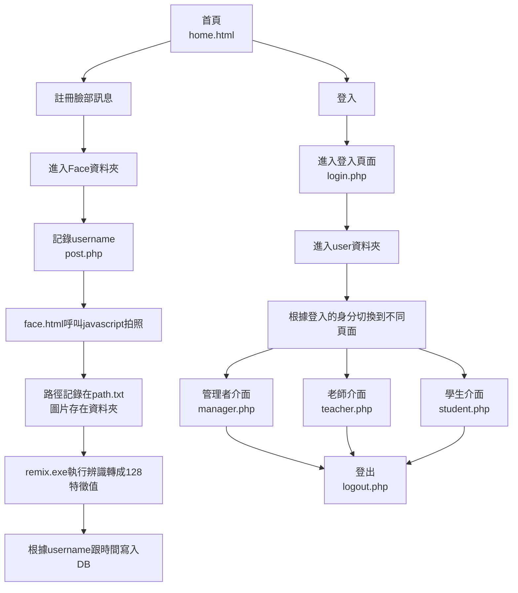

# topic
## 流程圖如下

```mermaid
graph 

A[首頁<br>home.html]-->註冊臉部訊息-->進入Face資料夾-->B[記錄username<br>post.php]--> face.html呼叫javascript拍照-->C[路徑記錄在path.txt<br>圖片存在資料夾]-->remix.exe執行辨識轉成128特徵值-->根據username跟時間寫入DB


A --> 登入 --> D[進入登入頁面<br>login.php]-->進入user資料夾 --> E[根據登入的身分切換到不同頁面]

E-->F[管理者介面<br>manager.php]-->I
E-->G[老師介面<br>teacher.php]-->I
E-->H[學生介面<br>student.php]-->I

I[登出<br>logout.php]

```

**只要進入home.html頁面，session的username就會清除**
