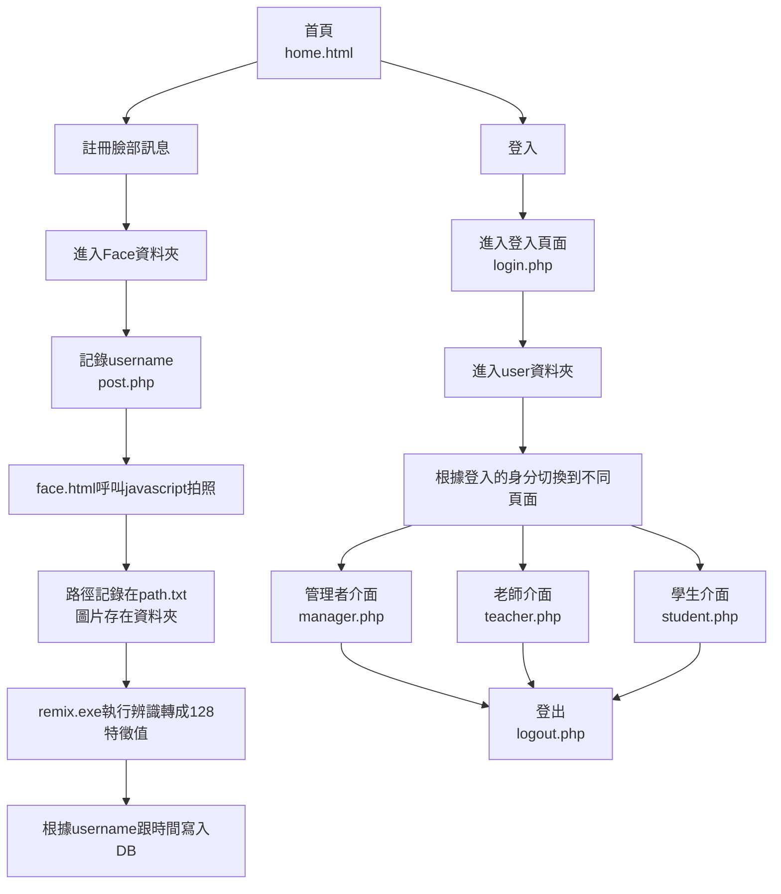

# topic
## 流程圖如下

##以下粗略介紹各檔案的用途

### home.html
**只要進入home.html頁面，session的username就會清除**

### logxx.php
負責登入登出

### set.php
與DB的設定檔在裡面

### Face 資料夾
post.php
登入系統
將使用者的科系年級姓名紀錄，之後用於寫入DB

face.html
呼叫JS資料夾中的webcam.js來拍照

action.php
設定拍照的檔案存取地點

remix.exe
本體是用python做的人臉辨識模型，需要做

CSV.php
將remix.exe的執行結果寫入DB

### user 資料夾
manager.php
管理者介面，可以刪除學生、補點、查詢課程
**新增學生需要在DB匯入，可單筆可多筆**

teacher.php
老師介面，可以補點、查詢課程學生名單、點名情況

student.php
學生介面，可以查詢點名情況

